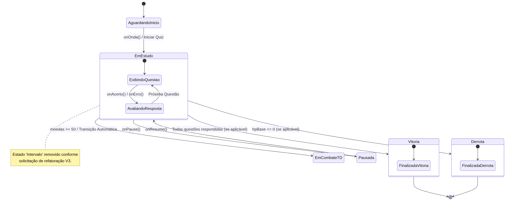
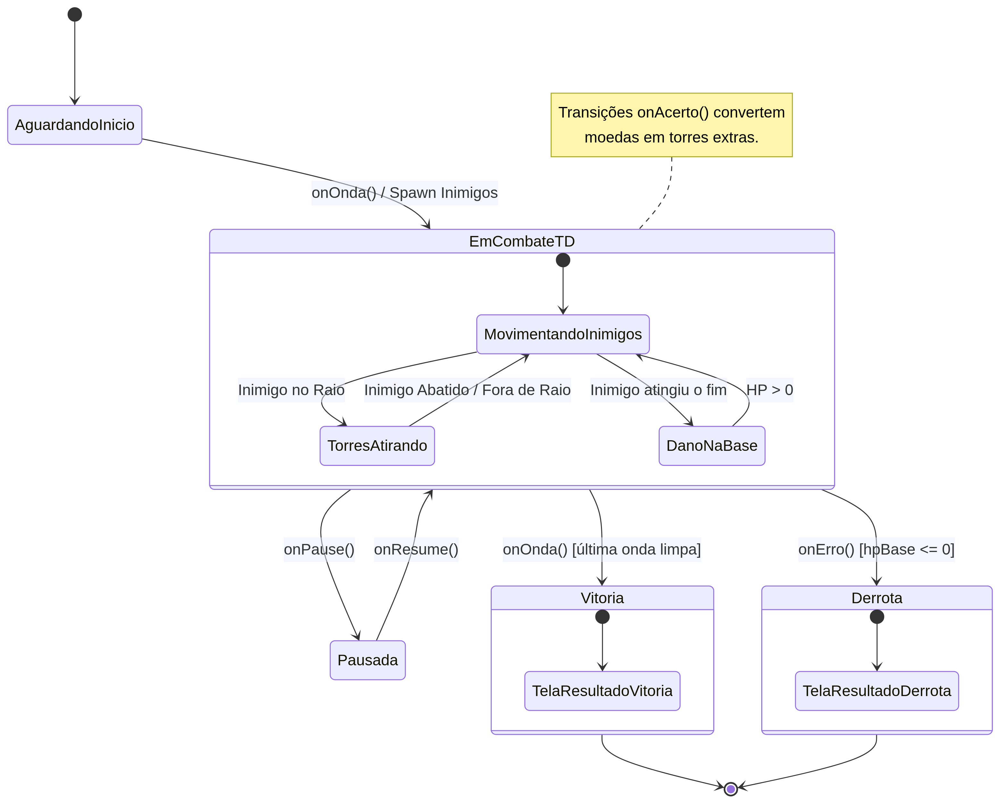
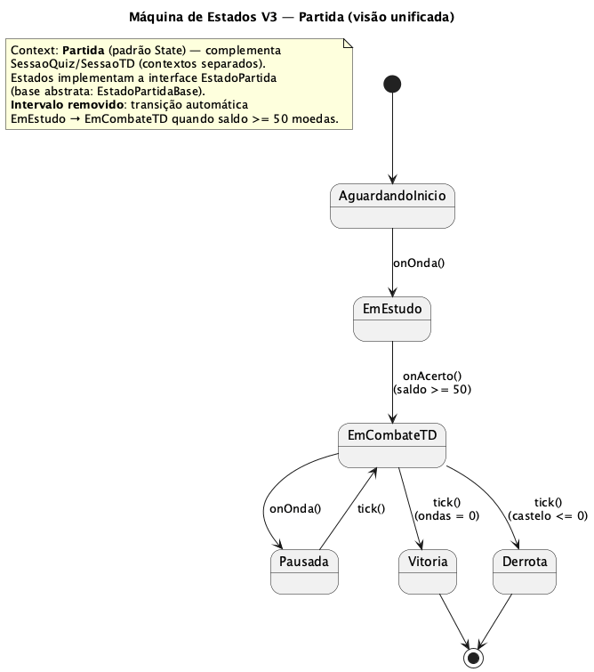
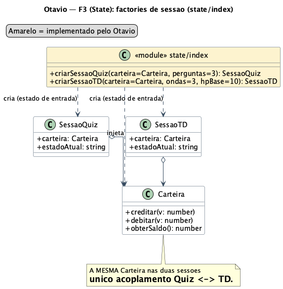

# 3.3. Módulo Padrões de Projeto GoFs Comportamentais

Foco_3: Padrões de Projeto GoFs Comportamentais.

Entrega Mínima: 1 Padrão GoF Comportamental, com nível de modelagem e nível de implementação evidenciados (ou seja, código rodando e hospedado no repositório do projeto).

Apresentação (para a professora via vídeo enviado por e-mail) explicando o GoF Comportamental, com: (i) rastro claro aos membros participantes (MOSTRAR QUADRO DE PARTICIPAÇÕES & COMMITS); (ii) justificativas & senso crítico sobre o padrão GOF comportamental; e (iii) comentários gerais sobre o trabalho em equipe. Tempo da Apresentação: +/- 5min. Recomendação: Apresentar diretamente via Wiki ou GitPages do Projeto. Baixar os conteúdos com antecedência, evitando problemas de internet no momento de exposição via Vídeo nas Dinâmicas de Avaliação. Deve ser mostrado o GoF Comportamental em execução no vídeo.

A Wiki ou GitPages do Projeto deve conter um tópico dedicado ao Módulo Padrões de Projeto GoFs Comportamentais, com 1 padrão GoF Comportamental (modelagem & implementação, com código rodando), histórico de versões, referências, e demais detalhamentos gerados pela equipe nesse escopo.

Demais orientações disponíveis nas Diretrizes (vide Moodle).

## Padrão escolhido: State

### Intenção (definição GoF)

> "Permitir que um objeto altere seu comportamento quando seu estado interno muda. O objeto parecerá ter mudado de classe." (GAMMA et al., 1994)

É um padrão **comportamental** que substitui condicionais (`if`/`switch`) espalhadas pelo código por uma hierarquia polimórfica de classes, cada uma representando um *estado*.

### Estrutura

- **Context** (`Partida`, `SessaoQuiz`, `SessaoTD`): mantém referência ao `State` atual e delega-lhe as requisições; expõe `setEstado(novoEstado)`.
- **State** (interface): declara a interface comum dos estados concretos (`tick`, `onAcerto`, `onErro`, `onOnda` / `iniciar`, `comprar`, `pronto`).
- **ConcreteState**: implementa o comportamento associado a um estado e pode disparar a transição chamando `context.setEstado(...)`.

### Quando usar / quando não usar

- **Use** quando o comportamento depende do estado e muda em *runtime*; quando há condicionais grandes baseadas em `enum`/*flags*; quando as transições formam uma máquina de estados clara.
- **Evite** se há poucos estados estáveis (um `enum` + `switch` é mais simples), se os estados não compartilham interface comum, ou se o *overhead* de classes não compensa.

### Senso crítico — State vs. Strategy (ponto clássico de prova)

Ambos compartilham a *mesma estrutura UML* (Context delega a uma interface polimórfica). As diferenças estão na **intenção** e no **uso**:

- **Intenção:** Strategy encapsula *algoritmos intercambiáveis* escolhidos pelo cliente (ex.: ordenação rápida vs. bolha). State encapsula *estados de um objeto* e seu comportamento dependente.
- **Quem troca:** em Strategy, o *cliente externo* define a estratégia; em State, os próprios estados decidem a transição (ou o Context internamente).
- **Conhecimento mútuo:** `ConcreteState`s frequentemente conhecem-se (um transita para outro); `Strategy`s são independentes.
- **Ciclo de vida:** a Strategy tende a ser estável durante a execução; o State muda frequentemente.
- **Modelo mental:** Strategy responde *"como fazer?"*; State responde *"o que fazer agora, dada a situação?"*.

### Aplicação ao Battle Class

A `Partida` é o *Context* unificado (máquina V3). Os estados foram mapeados a partir do **Diagrama de Máquina de Estados V1/V2** da Entrega 02:

| Estado | tick() | onAcerto() | onErro() | onOnda() |
| ------ | ------ | ---------- | -------- | -------- |
| AguardandoInicio | no-op | ignora | ignora | transita p/ EmEstudo |
| EmEstudo | conta tempo | credita moedas; pode ir p/ EmCombateTD | penaliza moedas | ignora |
| EmCombateTD | move inimigos, dispara torres | converte em torre extra | reduz HP base | spawn de onda |
| Pausada | congela timers | ignora | ignora | ignora |
| Vitoria / Derrota | terminal | — | — | — |

Cada estado encapsula sua regra; a `Partida` não precisa de `switch(estadoAtual)`. Em paralelo, o projeto mantém dois *Contexts* especializados — `SessaoQuiz` (modo estudo) e `SessaoTD` (modo tower defense) — acoplados apenas pela `Carteira`.

## Implementação e Modelagem (Foco 3)

### O que foi desenvolvido

- Implementação do `SessaoTD` como contexto com operações `iniciar`, `comprar`, `pronto` e `tick`.
- Ajuste do contrato `EstadoTD` e base abstrata para o fluxo do ciclo de jogo.
- Regra de débito da `Carteira` no estado `ComprandoTorres`.
- Bloqueio de transições inválidas nos estados terminais (`Vitoria`/`Derrota`).
- Máquina de estados unificada V3 (`Partida`) sobre os dois contextos.
- Atualização de teste e demo para o fluxo completo com compra entre ondas.

### Evidências de implementação

- [SessaoTD.ts](https://github.com/UnBArqDsw2026-1-Turma02/2026.01-T02_G6_Battle_Class_Entrega_03/blob/main/src/state/td/SessaoTD.ts)
- [EstadoTD.ts](https://github.com/UnBArqDsw2026-1-Turma02/2026.01-T02_G6_Battle_Class_Entrega_03/blob/main/src/state/td/EstadoTD.ts)
- [ComprandoTorres.ts](https://github.com/UnBArqDsw2026-1-Turma02/2026.01-T02_G6_Battle_Class_Entrega_03/blob/main/src/state/td/ComprandoTorres.ts)
- [EmBatalha.ts](https://github.com/UnBArqDsw2026-1-Turma02/2026.01-T02_G6_Battle_Class_Entrega_03/blob/main/src/state/td/EmBatalha.ts)
- [Vitoria.ts](https://github.com/UnBArqDsw2026-1-Turma02/2026.01-T02_G6_Battle_Class_Entrega_03/blob/main/src/state/td/Vitoria.ts)
- [Derrota.ts](https://github.com/UnBArqDsw2026-1-Turma02/2026.01-T02_G6_Battle_Class_Entrega_03/blob/main/src/state/td/Derrota.ts)
- [Partida.ts](https://github.com/UnBArqDsw2026-1-Turma02/2026.01-T02_G6_Battle_Class_Entrega_03/blob/main/src/modules/game/Partida.ts) (máquina unificada V3)
- [state/index.ts](https://github.com/UnBArqDsw2026-1-Turma02/2026.01-T02_G6_Battle_Class_Entrega_03/blob/main/src/state/index.ts) (factories de sessão)
- [state.test.ts](https://github.com/UnBArqDsw2026-1-Turma02/2026.01-T02_G6_Battle_Class_Entrega_03/blob/main/tests/state.test.ts)
- [demo-state.ts](https://github.com/UnBArqDsw2026-1-Turma02/2026.01-T02_G6_Battle_Class_Entrega_03/blob/main/demos/demo-state.ts)

Execução: `npm run demo:state` e `npm test`.

### Evidências de modelagem

- Diagrama UML (State)

- Máquinas de estados V3 — Quiz e TD (Thiago)

- Máquina de estados unificada V3 — `Partida`

- Diagrama de classes das factories de sessão (Otávio)

- Diagramas V3 (PlantUML, fontes): [`state_partida_v3.puml`](diagramas/state_partida_v3.puml), [`state_sessao_quiz_v3.puml`](diagramas/state_sessao_quiz_v3.puml), [`state_sessao_td_v3.puml`](diagramas/state_sessao_td_v3.puml).

## Rastreabilidade ao projeto (Entrega 02)

O Diagrama de Máquina de Estados [V1](../../docs_entrega_2/assets/diagramas/estatica/DiagramaMaquinaDeEstados-V1.png) / [V2](../../docs_entrega_2/assets/diagramas/estatica/DiagramaMaquinaDeEstados-V2.png) da Entrega 02 explicitamente separou `Vitoria` e `Derrota` (sugestão incorporada da Marina) e nomeou os demais estados; o padrão State *materializa* esse diagrama em código, evoluindo para a **V3** desta entrega. Os Diagramas de Sequência e de Atividades mostram as transições que aqui aparecem como chamadas a `ctx.setEstado(...)`.

## Histórico de Versões

| Versão | Data | Descrição | Autor(es) | Comprobatório |
| ------ | ---- | --------- | --------- | ------------- |
| 1.0 | 21/05/2026 | `Carteira` (saldo/crédito/débito + auditoria) | Dannyeclisson Costa | [`2175723`](https://github.com/UnBArqDsw2026-1-Turma02/2026.01-T02_G6_Battle_Class_Entrega_03/commit/2175723) |
| 1.1 | 21/05/2026 | Estados terminais do TD (`Vitoria`/`Derrota`) | Gabriela Tiago | [`fcb94ba`](https://github.com/UnBArqDsw2026-1-Turma02/2026.01-T02_G6_Battle_Class_Entrega_03/commit/fcb94ba) |
| 1.2 | 21/05/2026 | Fluxo TD: compra por estado + transições | Marina Galdi | [`b7ca6dd`](https://github.com/UnBArqDsw2026-1-Turma02/2026.01-T02_G6_Battle_Class_Entrega_03/commit/b7ca6dd) |
| 2.0 (V3) | 22/05/2026 | Máquina unificada `Partida` + diagramas V3 | Thiago Tonin | [`d614557`](https://github.com/UnBArqDsw2026-1-Turma02/2026.01-T02_G6_Battle_Class_Entrega_03/commit/d614557) |
| 2.1 | 22/05/2026 | Factories de sessão `criarSessaoQuiz`/`criarSessaoTD` | Otávio Maya | [`6642867`](https://github.com/UnBArqDsw2026-1-Turma02/2026.01-T02_G6_Battle_Class_Entrega_03/commit/6642867) |

## Referências

- GAMMA, E.; HELM, R.; JOHNSON, R.; VLISSIDES, J. **Design Patterns**. Addison-Wesley, 1994.
- Refactoring Guru — **State (PT-BR)**. Disponível em: https://refactoring.guru/pt-br/design-patterns/state
- FREEMAN, E.; ROBSON, E. **Use a Cabeça! Padrões de Projetos**. 2. ed. Alta Books.
- MARTIN, R. C. **Agile Principles, Patterns, and Practices in C#**. Prentice Hall, 2006.
- SOURCEMAKING. **State Design Pattern**. Disponível em: https://sourcemaking.com/design_patterns/state
