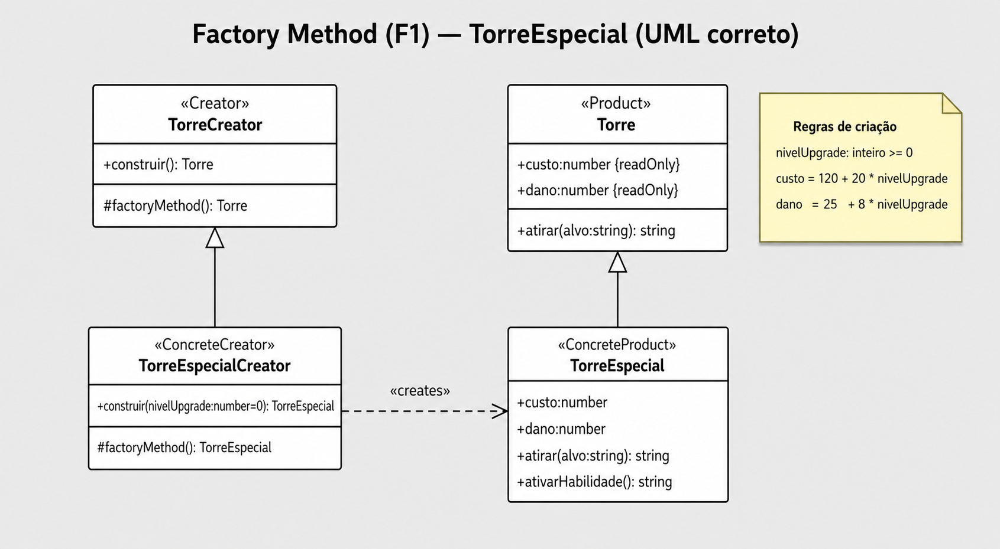
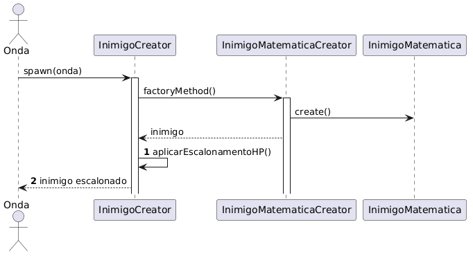
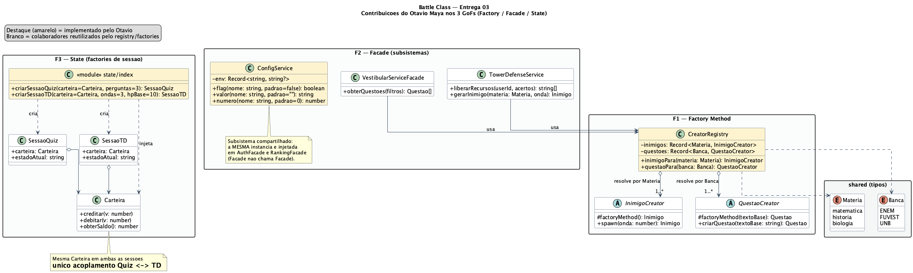
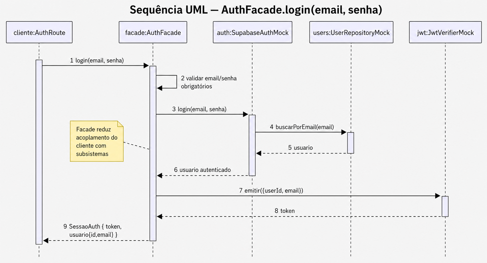
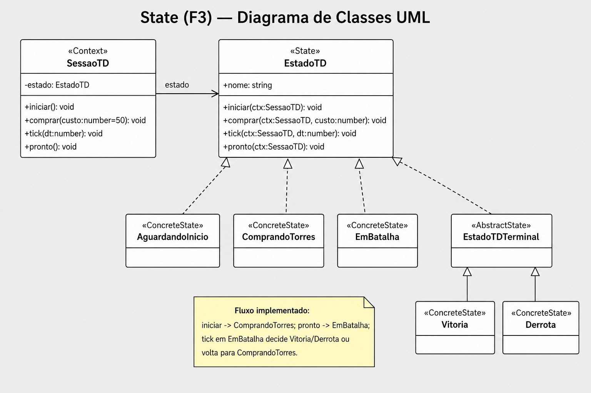

# 3.4. Participações - Padrões de Projeto

Breve relato sobre as participações/contribuições de cada membro à entrega de **Padrões de Projeto (GoFs)**. Cada linha traz a contribuição, a significância e os **comprobatórios** (commit, arquivo de implementação e/ou diagrama).

> **Convenção de links.** Commits e arquivos apontam para o repositório no GitHub (branch `main`). Diagramas de modelagem desta entrega estão em [`docs/PadroesDeProjeto/diagramas/`](diagramas/). A rastreabilidade com a modelagem da Entrega 02 é detalhada na seção [Rastreabilidade com a Entrega 02](#rastreabilidade-com-a-entrega-02).

## Quadro-resumo de commits por membro

| Membro | Commits principais (E03) |
| ------ | ------------------------ |
| Otávio Maya | [`6642867`](https://github.com/UnBArqDsw2026-1-Turma02/2026.01-T02_G6_Battle_Class_Entrega_03/commit/6642867), [`c7f4dec`](https://github.com/UnBArqDsw2026-1-Turma02/2026.01-T02_G6_Battle_Class_Entrega_03/commit/c7f4dec), [`0fc967d`](https://github.com/UnBArqDsw2026-1-Turma02/2026.01-T02_G6_Battle_Class_Entrega_03/commit/0fc967d), [`74ccafd`](https://github.com/UnBArqDsw2026-1-Turma02/2026.01-T02_G6_Battle_Class_Entrega_03/commit/74ccafd) |
| Gabriela Tiago de Araújo | [`8318266`](https://github.com/UnBArqDsw2026-1-Turma02/2026.01-T02_G6_Battle_Class_Entrega_03/commit/8318266), [`e87f5ab`](https://github.com/UnBArqDsw2026-1-Turma02/2026.01-T02_G6_Battle_Class_Entrega_03/commit/e87f5ab), [`23c6577`](https://github.com/UnBArqDsw2026-1-Turma02/2026.01-T02_G6_Battle_Class_Entrega_03/commit/23c6577), [`e748055`](https://github.com/UnBArqDsw2026-1-Turma02/2026.01-T02_G6_Battle_Class_Entrega_03/commit/e748055), [`fcb94ba`](https://github.com/UnBArqDsw2026-1-Turma02/2026.01-T02_G6_Battle_Class_Entrega_03/commit/fcb94ba), [`30c3a81`](https://github.com/UnBArqDsw2026-1-Turma02/2026.01-T02_G6_Battle_Class_Entrega_03/commit/30c3a81) |
| Marina Agostini Galdi | [`5e54615`](https://github.com/UnBArqDsw2026-1-Turma02/2026.01-T02_G6_Battle_Class_Entrega_03/commit/5e54615), [`6a05727`](https://github.com/UnBArqDsw2026-1-Turma02/2026.01-T02_G6_Battle_Class_Entrega_03/commit/6a05727), [`b7ca6dd`](https://github.com/UnBArqDsw2026-1-Turma02/2026.01-T02_G6_Battle_Class_Entrega_03/commit/b7ca6dd) |
| Dannyeclisson Costa | [`b8ad82e`](https://github.com/UnBArqDsw2026-1-Turma02/2026.01-T02_G6_Battle_Class_Entrega_03/commit/b8ad82e), [`498d1ad`](https://github.com/UnBArqDsw2026-1-Turma02/2026.01-T02_G6_Battle_Class_Entrega_03/commit/498d1ad), [`2175723`](https://github.com/UnBArqDsw2026-1-Turma02/2026.01-T02_G6_Battle_Class_Entrega_03/commit/2175723), [`60f58d9`](https://github.com/UnBArqDsw2026-1-Turma02/2026.01-T02_G6_Battle_Class_Entrega_03/commit/60f58d9) |
| João Carlos Lobo | [`ae5f5e4`](https://github.com/UnBArqDsw2026-1-Turma02/2026.01-T02_G6_Battle_Class_Entrega_03/commit/ae5f5e4), [`a3e5c8f`](https://github.com/UnBArqDsw2026-1-Turma02/2026.01-T02_G6_Battle_Class_Entrega_03/commit/a3e5c8f) |
| Thiago Tonin | [`d614557`](https://github.com/UnBArqDsw2026-1-Turma02/2026.01-T02_G6_Battle_Class_Entrega_03/commit/d614557) |
| Eric Akio Nishimura | [`91c95d5`](https://github.com/UnBArqDsw2026-1-Turma02/2026.01-T02_G6_Battle_Class_Entrega_03/commit/91c95d5) |
| Ana Elisa Ramos | _sem commit registrado na E03 até o momento_ |
| João Victor Sapiência | demos + testes + comprovatórios (ver [comprovatórios](../assets/comprovatorios/joaosapiencia/README.md)) — _sem commit registrado na E03 até o momento_ |
| Lucas Oliveira D. M. Ferreira | _sem commit registrado na E03 até o momento_ |

---

## Padrão GoF Criacional — Factory Method

Pasta-alvo: [`src/server/factories/`](https://github.com/UnBArqDsw2026-1-Turma02/2026.01-T02_G6_Battle_Class_Entrega_03/tree/main/src/server/factories). Rastreabilidade E02: [Diagrama de Classes](#rastreabilidade-com-a-entrega-02).

| Nome do Membro | Contribuição | Significância  (Excelente/Boa/Regular/Ruim/Nula) | Comprobatórios |
| -------------- | ------------ | --------------------------------------------------- | -------------- |
| Marina Agostini Galdi | Evolução do `TorreEspecialCreator` com `nivelUpgrade`; regras de custo/dano em `TorreEspecial`; testes e demo; diagrama do Factory Method | Excelente | [Commit `5e54615`](https://github.com/UnBArqDsw2026-1-Turma02/2026.01-T02_G6_Battle_Class_Entrega_03/commit/5e54615) · [TorreEspecialCreator.ts](https://github.com/UnBArqDsw2026-1-Turma02/2026.01-T02_G6_Battle_Class_Entrega_03/blob/main/src/server/factories/torre/TorreEspecialCreator.ts) ·  |
| Dannyeclisson Costa | Classe abstrata `Torre` + `TorreCreator` com regra-template de custo por onda; `TorreComum` | Boa | [Commit `b8ad82e`](https://github.com/UnBArqDsw2026-1-Turma02/2026.01-T02_G6_Battle_Class_Entrega_03/commit/b8ad82e) · [TorreCreator.ts](https://github.com/UnBArqDsw2026-1-Turma02/2026.01-T02_G6_Battle_Class_Entrega_03/blob/main/src/server/factories/torre/TorreCreator.ts) |
| João Carlos Lobo | Família `Inimigo` completa: `ConcreteProducts`/`ConcreteCreators` das variantes Padrão/Rápido/Tanque para Matemática, História e Biologia; testes | Excelente | [Commit `ae5f5e4`](https://github.com/UnBArqDsw2026-1-Turma02/2026.01-T02_G6_Battle_Class_Entrega_03/commit/ae5f5e4) · [Commit `a3e5c8f`](https://github.com/UnBArqDsw2026-1-Turma02/2026.01-T02_G6_Battle_Class_Entrega_03/commit/a3e5c8f) · [factories/inimigo/](https://github.com/UnBArqDsw2026-1-Turma02/2026.01-T02_G6_Battle_Class_Entrega_03/tree/main/src/server/factories/inimigo) |
| Eric Akio Nishimura | Corpo do *template method* `InimigoCreator.spawn(onda)` (escalonamento de HP por onda) compartilhado pelas 3 famílias; diagrama de comunicação | Boa | [Commit `91c95d5`](https://github.com/UnBArqDsw2026-1-Turma02/2026.01-T02_G6_Battle_Class_Entrega_03/commit/91c95d5) · [InimigoCreator.ts](https://github.com/UnBArqDsw2026-1-Turma02/2026.01-T02_G6_Battle_Class_Entrega_03/blob/main/src/server/factories/inimigo/InimigoCreator.ts) ·  |
| Gabriela Tiago de Araújo | `RoletaCreator` + `RoletaSequencial` (produto que sorteia a próxima `Materia`) e integração com o `QuizService`; testes | Excelente | [Commit `8318266`](https://github.com/UnBArqDsw2026-1-Turma02/2026.01-T02_G6_Battle_Class_Entrega_03/commit/8318266) · [Commit `e87f5ab`](https://github.com/UnBArqDsw2026-1-Turma02/2026.01-T02_G6_Battle_Class_Entrega_03/commit/e87f5ab) · [factories/roleta/](https://github.com/UnBArqDsw2026-1-Turma02/2026.01-T02_G6_Battle_Class_Entrega_03/tree/main/src/server/factories/roleta) |
| Otávio Maya | Barrel + `CreatorRegistry` mapeando `Materia → InimigoCreator` e `Banca → QuestaoCreator` (elimina `if/else` sobre tipos concretos), consumido por `VestibularServiceFacade` e `TowerDefenseService`; scaffold das famílias `Questao` | Excelente | [Commit `6642867`](https://github.com/UnBArqDsw2026-1-Turma02/2026.01-T02_G6_Battle_Class_Entrega_03/commit/6642867) · [factories/index.ts](https://github.com/UnBArqDsw2026-1-Turma02/2026.01-T02_G6_Battle_Class_Entrega_03/blob/main/src/server/factories/index.ts) ·  |
| João Victor Sapiência | Demos executáveis do Factory Method (cenários + erro) e testes adicionais do `CreatorRegistry` | Boa | [demo-joaosapiencia-factory.ts](https://github.com/UnBArqDsw2026-1-Turma02/2026.01-T02_G6_Battle_Class_Entrega_03/blob/main/demos/demo-joaosapiencia-factory.ts) · [joaosapiencia-factory.test.ts](https://github.com/UnBArqDsw2026-1-Turma02/2026.01-T02_G6_Battle_Class_Entrega_03/blob/main/tests/joaosapiencia-factory.test.ts) · [Comprobatórios](../assets/comprovatorios/joaosapiencia/README.md) |
| Lucas Oliveira D. M. Ferreira | _Atribuído: refino da família `Questao` e revisão de multiplicidades — sem commit registrado na E03 até o momento._ | A definir | — |

---

## Padrão GoF Estrutural — Facade

Pasta-alvo: [`src/server/facades/`](https://github.com/UnBArqDsw2026-1-Turma02/2026.01-T02_G6_Battle_Class_Entrega_03/tree/main/src/server/facades). Rastreabilidade E02: [Diagrama de Componentes / Pacotes](#rastreabilidade-com-a-entrega-02).

| Nome do Membro | Contribuição | Significância  (Excelente/Boa/Regular/Ruim/Nula) | Comprobatórios |
| -------------- | ------------ | --------------------------------------------------- | -------------- |
| Marina Agostini Galdi | `AuthFacade` (`registrar`/`login`/`validarToken`) + subsistemas mock (`SupabaseAuthMock`, `JwtVerifierMock`, `UserRepositoryMock`) + rota adaptadora; testes e demo; diagrama de sequência | Excelente | [Commit `6a05727`](https://github.com/UnBArqDsw2026-1-Turma02/2026.01-T02_G6_Battle_Class_Entrega_03/commit/6a05727) · [AuthFacade.ts](https://github.com/UnBArqDsw2026-1-Turma02/2026.01-T02_G6_Battle_Class_Entrega_03/blob/main/src/server/facades/AuthFacade.ts) ·  |
| Dannyeclisson Costa | `PartidaFacade` registrando dados completos da rodada + `PartidaRepository`; adaptador de rota `partida` | Boa | [Commit `498d1ad`](https://github.com/UnBArqDsw2026-1-Turma02/2026.01-T02_G6_Battle_Class_Entrega_03/commit/498d1ad) · [PartidaFacade.ts](https://github.com/UnBArqDsw2026-1-Turma02/2026.01-T02_G6_Battle_Class_Entrega_03/blob/main/src/server/facades/PartidaFacade.ts) |
| Gabriela Tiago de Araújo | Revisão do contrato público da `PartidaFacade` e fixação da ordem `quiz → economia → TD → repo`; teste de ordem | Boa | [Commit `23c6577`](https://github.com/UnBArqDsw2026-1-Turma02/2026.01-T02_G6_Battle_Class_Entrega_03/commit/23c6577) · [Commit `e748055`](https://github.com/UnBArqDsw2026-1-Turma02/2026.01-T02_G6_Battle_Class_Entrega_03/commit/e748055) · [facade.test.ts](https://github.com/UnBArqDsw2026-1-Turma02/2026.01-T02_G6_Battle_Class_Entrega_03/blob/main/tests/facade.test.ts) |
| Thiago Tonin | `RankingFacade` (`top`/`posicaoDoUsuario`) + subsistemas `CarteiraRepositoryMock` e `RankingRepositoryMock`; testes | Excelente | [Commit `d614557`](https://github.com/UnBArqDsw2026-1-Turma02/2026.01-T02_G6_Battle_Class_Entrega_03/commit/d614557) · [RankingFacade.ts](https://github.com/UnBArqDsw2026-1-Turma02/2026.01-T02_G6_Battle_Class_Entrega_03/blob/main/src/server/facades/RankingFacade.ts) |
| Otávio Maya | `ConfigService` (subsistema compartilhado, lê flags de ambiente, injetado em mais de uma Facade sem que uma conheça a outra); ligação de `VestibularServiceFacade`/`TowerDefenseService` ao `CreatorRegistry` | Boa | [Commit `6642867`](https://github.com/UnBArqDsw2026-1-Turma02/2026.01-T02_G6_Battle_Class_Entrega_03/commit/6642867) · [ConfigService.ts](https://github.com/UnBArqDsw2026-1-Turma02/2026.01-T02_G6_Battle_Class_Entrega_03/blob/main/src/server/facades/subsistemas/ConfigService.ts) ·  |
| João Victor Sapiência | Demos executáveis da Facade (Partida/Ranking/Vestibular/Auth) e teste de erro de login no `AuthFacade` | Boa | [demo-joaosapiencia-facade.ts](https://github.com/UnBArqDsw2026-1-Turma02/2026.01-T02_G6_Battle_Class_Entrega_03/blob/main/demos/demo-joaosapiencia-facade.ts) · [joaosapiencia-facade.test.ts](https://github.com/UnBArqDsw2026-1-Turma02/2026.01-T02_G6_Battle_Class_Entrega_03/blob/main/tests/joaosapiencia-facade.test.ts) · [Comprobatórios](../assets/comprovatorios/joaosapiencia/README.md) |
| Ana Elisa Ramos | _Atribuído: bateria de testes em `facade.test.ts` (caminho feliz + erro) — sem commit registrado na E03 até o momento._ | A definir | — |

---

## Padrão GoF Comportamental — State

Pasta-alvo: [`src/state/`](https://github.com/UnBArqDsw2026-1-Turma02/2026.01-T02_G6_Battle_Class_Entrega_03/tree/main/src/state). Rastreabilidade E02: [Diagrama de Máquina de Estados V1/V2](#rastreabilidade-com-a-entrega-02).

| Nome do Membro | Contribuição | Significância  (Excelente/Boa/Regular/Ruim/Nula) | Comprobatórios |
| -------------- | ------------ | --------------------------------------------------- | -------------- |
| Marina Agostini Galdi | Fluxo do TD com compra de torres por estado e transições de batalha (`SessaoTD`, `ComprandoTorres`, `EmBatalha`); diagrama de classes do State | Excelente | [Commit `b7ca6dd`](https://github.com/UnBArqDsw2026-1-Turma02/2026.01-T02_G6_Battle_Class_Entrega_03/commit/b7ca6dd) · [SessaoTD.ts](https://github.com/UnBArqDsw2026-1-Turma02/2026.01-T02_G6_Battle_Class_Entrega_03/blob/main/src/state/td/SessaoTD.ts) ·  |
| Gabriela Tiago de Araújo | Estados terminais do TD (`EstadoTDTerminal`, `Vitoria`, `Derrota`) com bloqueio de transições inválidas; testes | Excelente | [Commit `fcb94ba`](https://github.com/UnBArqDsw2026-1-Turma02/2026.01-T02_G6_Battle_Class_Entrega_03/commit/fcb94ba) · [Commit `30c3a81`](https://github.com/UnBArqDsw2026-1-Turma02/2026.01-T02_G6_Battle_Class_Entrega_03/commit/30c3a81) · [state/td/](https://github.com/UnBArqDsw2026-1-Turma02/2026.01-T02_G6_Battle_Class_Entrega_03/tree/main/src/state/td) |
| Dannyeclisson Costa | `Carteira` (saldo, `creditar`/`debitar`, auditoria de movimentos, exceção em saldo insuficiente) — dependência única entre os dois `Contexts` | Boa | [Commit `2175723`](https://github.com/UnBArqDsw2026-1-Turma02/2026.01-T02_G6_Battle_Class_Entrega_03/commit/2175723) · [Carteira.ts](https://github.com/UnBArqDsw2026-1-Turma02/2026.01-T02_G6_Battle_Class_Entrega_03/blob/main/src/state/Carteira.ts) |
| Thiago Tonin | Máquina de estados unificada **V3** (`Partida`) sobre os dois contextos; diagramas V3 (`SessaoQuiz`, `SessaoTD`, `Partida`); testes | Excelente | [Commit `d614557`](https://github.com/UnBArqDsw2026-1-Turma02/2026.01-T02_G6_Battle_Class_Entrega_03/commit/d614557) · [Partida.ts](https://github.com/UnBArqDsw2026-1-Turma02/2026.01-T02_G6_Battle_Class_Entrega_03/blob/main/src/modules/game/Partida.ts) · [Diagramas V3 (.puml)](https://github.com/UnBArqDsw2026-1-Turma02/2026.01-T02_G6_Battle_Class_Entrega_03/tree/main/docs/PadroesDeProjeto/diagramas) |
| Otávio Maya | Factories de sessão `criarSessaoQuiz(carteira)` / `criarSessaoTD(carteira)` em `state/index.ts` — ponto único que constrói cada `Context` no estado de entrada com a `Carteira` injetada | Boa | [Commit `6642867`](https://github.com/UnBArqDsw2026-1-Turma02/2026.01-T02_G6_Battle_Class_Entrega_03/commit/6642867) · [state/index.ts](https://github.com/UnBArqDsw2026-1-Turma02/2026.01-T02_G6_Battle_Class_Entrega_03/blob/main/src/state/index.ts) ·  |
| Lucas Oliveira D. M. Ferreira | _Atribuído: `SessaoQuiz` (Context do modo estudo) — sem commit registrado na E03 até o momento._ | A definir | — |
| João Victor Sapiência | Demos executáveis do State (SessaoQuiz/SessaoTD) com cenários e erros + testes adicionais na Partida V3 | Boa | [demo-joaosapiencia-state.ts](https://github.com/UnBArqDsw2026-1-Turma02/2026.01-T02_G6_Battle_Class_Entrega_03/blob/main/demos/demo-joaosapiencia-state.ts) · [joaosapiencia-state.test.ts](https://github.com/UnBArqDsw2026-1-Turma02/2026.01-T02_G6_Battle_Class_Entrega_03/blob/main/tests/joaosapiencia-state.test.ts) · [joaosapiencia-partida.test.ts](https://github.com/UnBArqDsw2026-1-Turma02/2026.01-T02_G6_Battle_Class_Entrega_03/blob/main/tests/joaosapiencia-partida.test.ts) · [Comprobatórios](../assets/comprovatorios/joaosapiencia/README.md) |

---

## Diagrama de classes — contribuições do Otávio

Diagrama de classes (UML) das peças implementadas pelo Otávio nos três GoFs: o `CreatorRegistry` (F1), o `ConfigService` (F2) e as factories de sessão `criarSessaoQuiz`/`criarSessaoTD` (F3). Em amarelo, o que é de sua autoria; em branco, os colaboradores reutilizados.

Fonte editável: [`diagramas/gofs_otavio_classes_uml.puml`](diagramas/gofs_otavio_classes_uml.puml).

---

## Rastreabilidade com a Entrega 02

Os três GoFs implementados nesta entrega refinam decisões já registradas na modelagem da [Entrega 02](../../docs_entrega_2/Modelagem/2.1.ModelagemEstatica.md):

### Factory Method (F1) ↔ Diagrama de Classes (E02)

As hierarquias `Torre`, `Roleta` e `Questao` do **Diagrama de Classes** da E02 viraram famílias de *Product/Creator*. O `Inimigo` foi **promovido a classe de 1ª ordem** nesta entrega (na E02 era tratado como atributo da partida).

- Quadrante Torre: [`DiagramaDeClasseTopLeft.png`](../../docs_entrega_2/assets/diagramas/estatica/DiagramaDeClasseTopLeft.png)
- Quadrante Conhecimento (Roleta/Questão): [`DiagramaDeClasseBottomLeft.png`](../../docs_entrega_2/assets/diagramas/estatica/DiagramaDeClasseBottomLeft.png)

### Facade (F2) ↔ Diagrama de Componentes e Pacotes (E02)

Os componentes lógicos da E02 (`AuthService`, `MotorRoleta`, `SistemaEconomia`, `MotorTowerDefense`, `Ranking`) correspondem hoje às Facades e subsistemas: `AuthFacade`, `VestibularServiceFacade`, `PartidaFacade`, `TowerDefenseService` e `RankingFacade`.

- Pacotes do back-end: [`DiagramaDePacotes_Backend.png`](../../docs_entrega_2/assets/diagramas/estatica/DiagramaDePacotes_Backend.png)

### State (F3) ↔ Diagrama de Máquina de Estados (E02)

A máquina de estados da E02 (V1 → V2) evoluiu para a **V3** desta entrega, agora separada em dois `Contexts` (`SessaoQuiz` e `SessaoTD`) acoplados apenas pela `Carteira`, com a máquina unificada `Partida` por cima.

---

> TODOS DEVEM PARTICIPAR, MOSTRANDO SEUS PONTOS DE VISTA E COMO COLABORARAM NESSA ETAPA DA ENTREGA COM COMPROBATÓRIOS.
