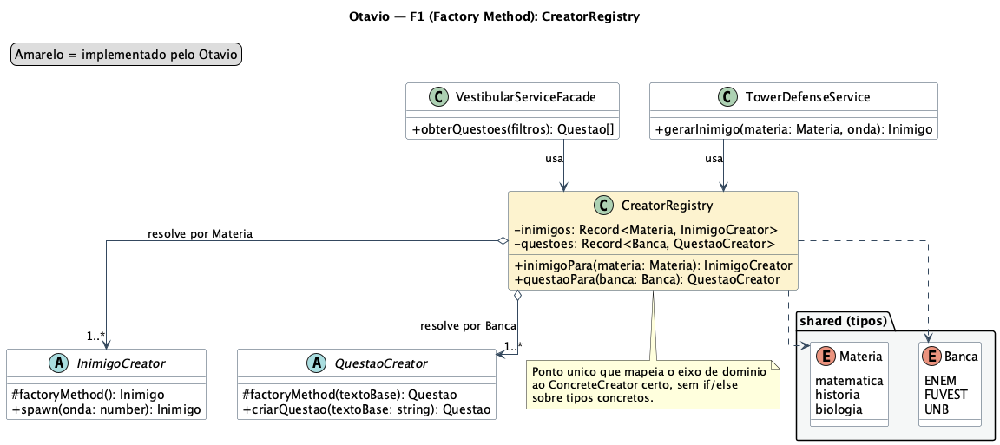
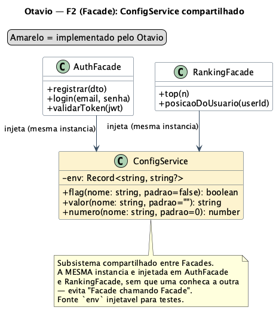

# Comprobatórios — Otávio Maya

## F1 — Factory Method (CreatorRegistry)

### Escopo

- Barrel das famílias de Factory + `CreatorRegistry` em `src/server/factories/index.ts`.
- Mapeamento `Materia → InimigoCreator` e `Banca → QuestaoCreator`, consumido por `VestibularServiceFacade` e `TowerDefenseService`.
- Scaffold inicial das famílias `Questao` e dos contratos compartilhados.

### Decisões técnicas

- O registry centraliza a resolução do ConcreteCreator e elimina `if/else` sobre tipos concretos nos serviços de aplicação.
- Os mapas são injetáveis (default = famílias padrão) para facilitar teste e substituição.
- Caminho de erro explícito: `MateriaInexistenteError` (matéria) e `EntradaInvalidaError` (banca).

### Evidências

- Código: `src/server/factories/index.ts`
- Commit: [`6642867`](https://github.com/UnBArqDsw2026-1-Turma02/2026.01-T02_G6_Battle_Class_Entrega_03/commit/6642867)
- Diagrama: 

## F2 — Facade (ConfigService compartilhado)

### Escopo

- `ConfigService` (lê *flags*/valores/números de ambiente) como subsistema compartilhado em `src/server/facades/subsistemas/`.
- Ligação de `VestibularServiceFacade` e `TowerDefenseService` ao `CreatorRegistry`.

### Decisões técnicas

- A mesma instância de `ConfigService` é injetada em mais de uma Facade sem que uma conheça a outra — evita "Facade chamando Facade".
- A fonte (`env`) é injetável para testes determinísticos.

### Evidências

- Código: `src/server/facades/subsistemas/ConfigService.ts`
- Commit: [`6642867`](https://github.com/UnBArqDsw2026-1-Turma02/2026.01-T02_G6_Battle_Class_Entrega_03/commit/6642867)
- Diagrama: 

## F3 — State (factories de sessão)

### Escopo

- Factories `criarSessaoQuiz(carteira)` e `criarSessaoTD(carteira)` em `src/state/index.ts`.
- Ponto único que constrói cada `Context` no estado de entrada com a `Carteira` injetada.

### Decisões técnicas

- Passar a mesma `Carteira` para as duas factories é o único acoplamento entre os Contexts (ver §1 do plano).
- As factories escondem de quem consome qual é o estado inicial concreto.

### Evidências

- Código: `src/state/index.ts`
- Commit: [`6642867`](https://github.com/UnBArqDsw2026-1-Turma02/2026.01-T02_G6_Battle_Class_Entrega_03/commit/6642867)
- Diagrama: 

## Transversais

- Scaffold dos 3 GoFs (contratos compartilhados, esqueleto, testes e demos iniciais): [`74ccafd`](https://github.com/UnBArqDsw2026-1-Turma02/2026.01-T02_G6_Battle_Class_Entrega_03/commit/74ccafd), [`0fc967d`](https://github.com/UnBArqDsw2026-1-Turma02/2026.01-T02_G6_Battle_Class_Entrega_03/commit/0fc967d), [`c7f4dec`](https://github.com/UnBArqDsw2026-1-Turma02/2026.01-T02_G6_Battle_Class_Entrega_03/commit/c7f4dec).
- Documentação da wiki (senso crítico, histórico de versões, participações) e diagrama de classes das contribuições.

## Validação local

```bash
npm run typecheck
npm test
npm run demo:factory
npm run demo:facade
npm run demo:state
```
